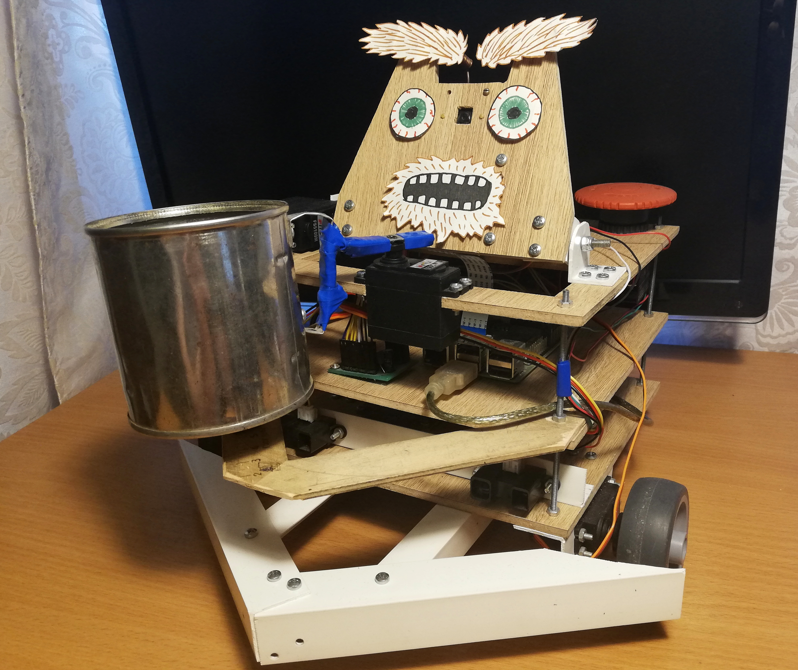

## Beggar Bot fun/study project

This cute robot roams around the room and kindly asks for money.

### Tech

1. Core
    * Hardware
        * Raspberry Pi 2B
        * A control switch
    * Software
        * [ROS](https://www.ros.org/)
2. Vision
    * Hardware
        * Raspberry Pi Camera module v2
        * Movidius Neural Compute Stick
    * Software
        * [RaspiCam](http://www.uco.es/investiga/grupos/ava/node/40)
        * [Intel OpenVINO for Raspbian](https://docs.openvinotoolkit.org/latest/_docs_install_guides_installing_openvino_raspbian.html)
        * [SSD face detector with SqueezeNet backbone](https://docs.openvinotoolkit.org/latest/_models_intel_face_detection_retail_0004_description_face_detection_retail_0004.html)
        * [SORT detection tracker](https://github.com/BeloborodovDS/sort-cpp)
3. Navigation
   * Hardware
       * Sharp GP2Y0A02YK ifrared sensor x2
       * MCP3008 analog-digital converter
   * Software
       * [MCP3008 controller](https://github.com/halherta/RaspberryPi-mcp3008Spi)
4. Motion 
    * Hardware
        * Adafruit PCA9685 PWM controller
        * SG90 servo
        * FS5109M servo x2
        * FS5103R continuous rotation servo x2
    * Software
        * [WiringPi](http://wiringpi.com/)
        * [PCA9685 controller](https://github.com/Reinbert/pca9685)
5. Power
    * Hardware
        * DFRobot Power Module x2
        * ROBITON 3.4/LI18650 accumulators x2
        * A huge red shutdown button

Dependencies:

* <a href="http://wiringpi.com/" target="_blank">WiringPi</a>
* <a href="https://docs.openvinotoolkit.org/latest/_docs_install_guides_installing_openvino_raspbian.html" target="_blank">OpenVINO + OpenCV for Raspbian</a>
* <a href="http://www.uco.es/investiga/grupos/ava/node/40" target="_blank">RaspiCam 0.1.6</a>
* <a href="https://github.com/Reinbert/pca9685" target="_blank">PCA9685 PWM controller</a>
* see submodules folder

Build:

~~~
catkin_make [-j1]
~~~

Download OpenVINO model for face detection: 

~~~
./download_model.bash
~~~

Launch:

~~~
roslaunch beggar_bot robot.launch
~~~
